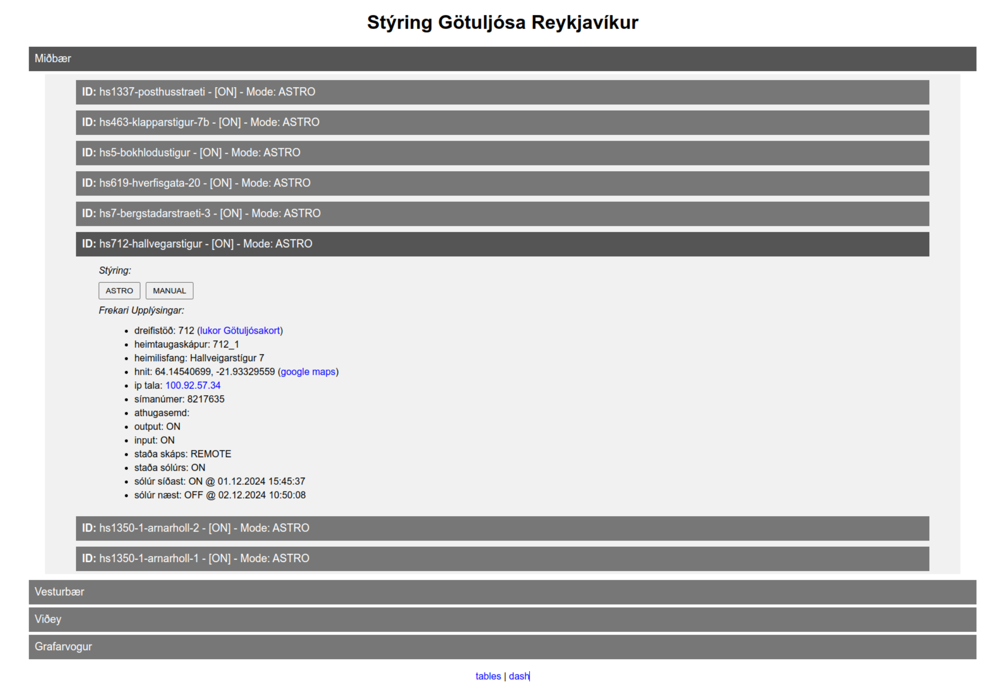
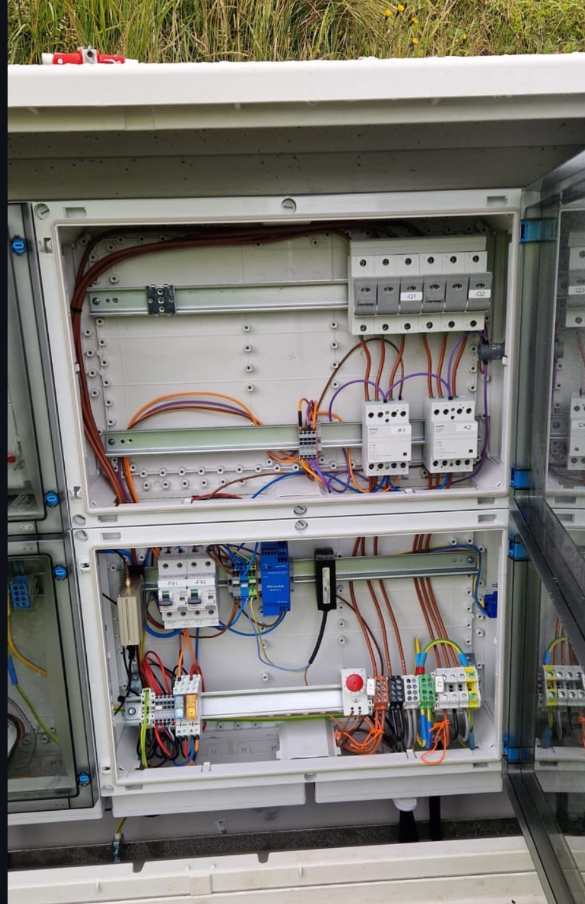
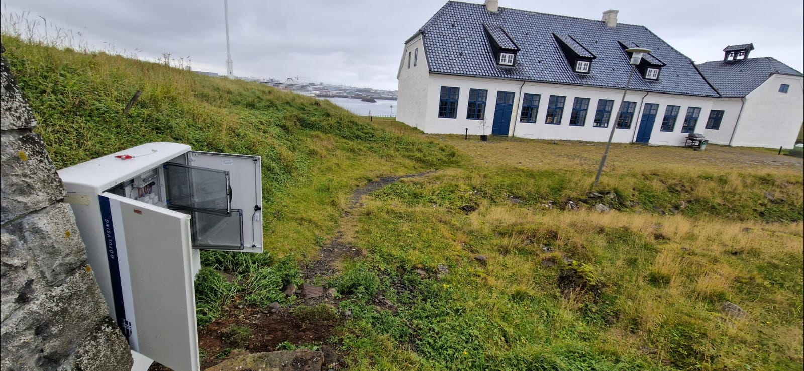

<p align="center">
  
</p>


**Gungnir** is an open-source proof-of-concept system designed to manage city streetlights efficiently and cost-effectively. Currently, it controls approximately 10% of Reykjavik's streetlights, including the downtown district, Viðey Island, and the west side of the old town. Built with simplicity, scalability, and interoperability in mind, Gungnir demonstrates how smaller municipalities can adopt a forward-thinking, taxpayer-friendly approach to lighting control using free and open-source tools.

## Project Goals
The core philosophy behind Gungnir is to develop a straightforward yet powerful system to minimize expenditure while maximizing functionality for citywide street lighting. This is achieved by focusing on the following principles:
- **Simplicity**: A system that works seamlessly with minimal complexity.
- **Interoperability**: Enabling easy integration with other systems via APIs.
- **Cost-Efficiency**: Optimizing for low operational and maintenance costs.

---

### System Diagram of Gungnir:


### Circuit Diagram of Hardware Terminations:


---

## Development Phases

- [x] **Phase 1: Simplicity** *(Completed)*  
  The foundation of Gungnir focuses on delivering essential features:
  - **Automated Lighting**: Streetlights turn on/off automatically based on astronomical calculations.
  - **Real-Time State Awareness**: Gungnir monitors device states:
    - States are reflected in an external-facing webUI.
    - Indicates locally overridden manual switches.

Interacive map of System:

[](https://reykjavik.gatnalysing.is/)

Basic WebUI Screenshot:


  - **Remote Override**: Operators can manually control the lights remotely as needed.
  - **Load Staggering**: Prevents simultaneous activation to reduce strain on the power grid.
  - **Hardware Installation**: Installation of a distributed system

### Hardware Installation:



### Cabinet in the Wild:




---

- [x] **Phase 2: Interoperability** *(Completed)*  
  To extend its functionality, Gungnir provides:  
  - **API Support**: Enables third-party applications to interact with the system.
  - **API Quick Start**:  

    1. **Set Device to MANUAL Mode**  
       ```bash
       curl -X POST -H "Content-Type: application/json" \
            -H "CF-Access-Client-Id: your_id" \
            -H "CF-Access-Client-Secret: your_secret" \
            -d '{"astroman": "MANUAL"}' \
            https://your_server/devices/{identifier}/astroman
       ```

    2. **Turn Device OFF**  
       ```bash
       curl -X POST -H "Content-Type: application/json" \
            -H "CF-Access-Client-Id: your_id" \
            -H "CF-Access-Client-Secret: your_secret" \
            -d '{"state": "OFF"}' \
            https://your_server/devices/{identifier}/state
       ```

    For a full list of endpoints and instructions, see [api-guide.md](./api-guide.md).

---

- [x] **Phase 3: Open-Source Release** *(Completed)*  
  Gungnir is publicly available under the [AGPL v3 License](./LICENSE.md) to foster community contributions and transparency. New features are added based on user requests.

---

- [ ] **Phase 4: Feature Expansion** *(In Progress)*  
  The current focus is on integrating requested features:
  - **Light Sensors**: Adding daylight sensors to offset on/off times based on ambient light and weather.
  - **Standalone Functionality**: Offline process to control lights on/off based on a pre-set schedule at the router level during internet outages.
  - **Coordinator Script**: Startup Management / Process Monitoring / Failure Notification

---

- [ ] **Phase 5: Impending Improvements** *(In Progress)*  
  Ongoing development is dedicated to enhancing the system’s scalability and robustness:
  - **Database and Framework Improvements**: Transitioning from SQLite/Flask to PostgreSQL/Gunicorn
  - **Redundancy**: Failover servers to ensure uptime during maintenance or outages.
  - **Containerization**: Packaging full system deployment planned in future updates.
  - **TALQ Compliance**: Aligning the system with international standards for smart city infrastructure.
  - **Enhanced Documentation**: Improving guides and references for developers and administrators.

---

## Contributing & Contact
Gungnir is still a work in progress, and I’d appreciate help setting up a contribution process. If you have ideas or want to get involved, feel free to reach out: [David Berman](mailto:david@berman.is).

---

## License
Gungnir is licensed under the [GNU Affero General Public License (AGPL) v3](./LICENSE.md), ensuring that any modifications or enhancements made to the software benefit the open-source community.

---

## Acknowledgments
Gungnir was developed with the goal of providing a modern, efficient solution for streetlight management. Thank you to the open-source community for inspiration and support. Also a big thanks to Jonathan and Már for your contributions, and Magdalega, Viðar and Fífí for your endless patience!
